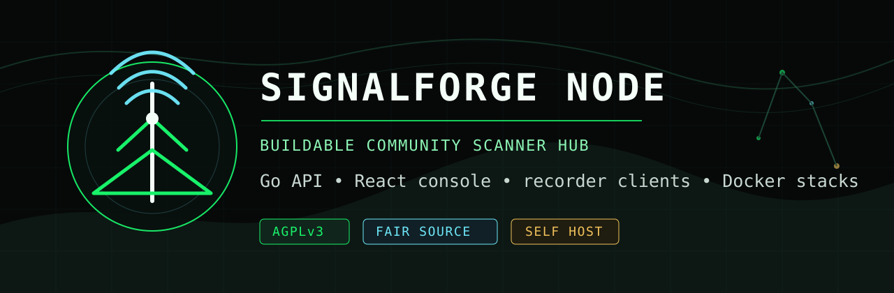

# SignalForge Node



Buildable public source for running a SignalForge/P7 Scanner community node.

This repo is the clean public mirror of the node stack: Go API server, React web console, recorder clients, Dockerfiles, compose files, database migrations, and operator docs. It is meant for people who want to run their own scanner hub, test SignalHub federation, or inspect how the public containers are built.

## License

SignalForge Node is licensed under the GNU Affero General Public License v3.0 or later. See [LICENSE](LICENSE), [GOVERNANCE.md](GOVERNANCE.md), and [FAIR-SOURCE.md](FAIR-SOURCE.md).

The intent is community infrastructure, not closed resale. If you run a modified network service from this code, AGPL requires you to offer the corresponding source code to users of that service.

SignalForge is fair-source aligned in spirit, but the code license remains AGPLv3-or-later so the public node stack stays open source.

## What Is Included

- `server/`: Go API, auth, ingest, database migrations, hub identity, peer invites, and federation endpoints.
- `client/`: React/Vite web console.
- `tools/`: recorder CLI and desktop tools.
- `docker/`: helper containers, including the mock call sender.
- `docs/`: architecture and operator notes.
- `docker-compose*.yml`: local, Plesk/Portainer, production-style, and peer-stack deployments.
- `.env.production.example` and `.env.peer.example`: safe example configuration only.

## What Is Not Included

- Real `.env` files.
- Production database dumps, volumes, call audio, or local node identity.
- Upload keys, Mailjet secrets, webhook URLs, passwords, or private deployment credentials.
- Any automatic claim that a node is verified or official.

## Fastest Path: Public Containers

Use the public images and a pinned short SHA tag:

```bash
cp .env.production.example .env
# edit .env for your domain, secrets, and tag
docker-compose --env-file .env -f docker-compose.plesk.yml up -d
```

Current public image names:

```text
ghcr.io/signalforge-org/p7-scanner-server:<tag>
ghcr.io/signalforge-org/p7-scanner-client:<tag>
ghcr.io/signalforge-org/p7-scanner-mock-call-sender:<tag>
```

The latest public tag is published at:

```text
https://signalforge.org/p7-scanner-update.json
```

Running hubs expose `GET /api/v1/update-check` so admins can see when a newer image tag is available.

## Build Locally

Start the whole stack from source:

```bash
docker-compose up --build -d
```

Server only:

```bash
cd server
go test ./...
go build ./...
```

Web console only:

```bash
cd client
npm ci
npm run build
```

Recorder CLI:

```bash
cd tools/p7-recorder-go
go test ./...
go build ./cmd/p7-recorder-go
```

## Run A Peer Test Stack

Use a second compose project when testing SignalHub federation:

```bash
cp .env.peer.example .env.peer
docker-compose --env-file .env.peer -f docker-compose.peer.yml up -d
```

Then enable federation in both hubs, create an invite on Hub A, and connect from Hub B with Hub A's public URL and invite token.

## Database

The mirror includes schema and migrations, not data. On first boot, each node creates its own Postgres tables and stores its own users, sources, calls, hub identity, peers, invites, talkgroups, and radio sets in its own volume.

Back up your own Postgres volume if the node matters.

## Trust Model

SignalForge is open source and peer-to-peer first, but trust is explicit:

- Anyone can run a node.
- Direct peering uses invite tokens.
- SignalForge can list known hubs.
- Verified and official status require maintainer approval.
- Remote sources stay labeled with their origin hub.

## Contributions

Pull requests are welcome. See [CONTRIBUTING.md](CONTRIBUTING.md), [GOVERNANCE.md](GOVERNANCE.md), and [FAIR-SOURCE.md](FAIR-SOURCE.md) before submitting changes. Security issues should be reported privately through [SECURITY.md](SECURITY.md).

Routine development targets the `dev` branch. Maintainers promote tested changes from `dev` to `main` when they are ready for public operators.

## Upstream

Core development currently happens in `projectseven-co-ltd/p7-scanner`. This repo is the public buildable mirror for SignalForge node operators.
